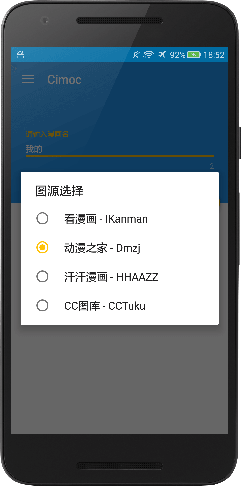
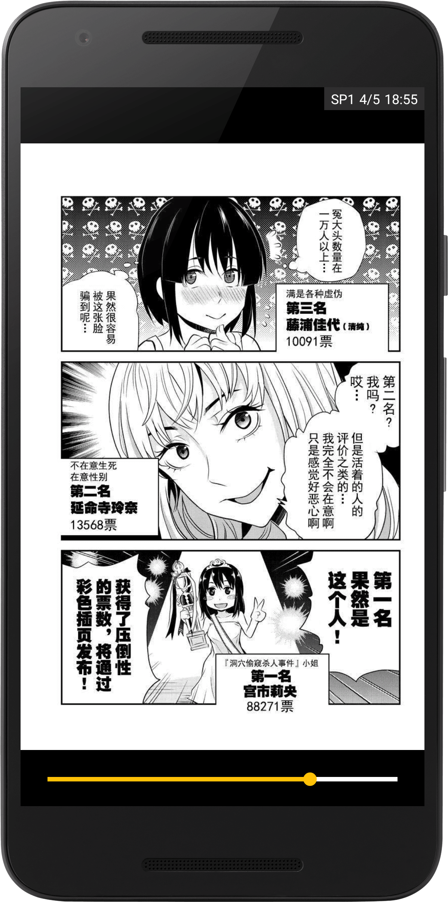
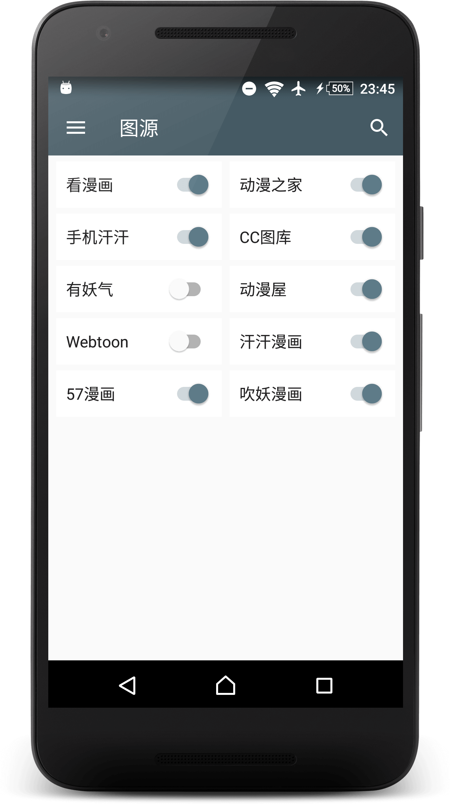
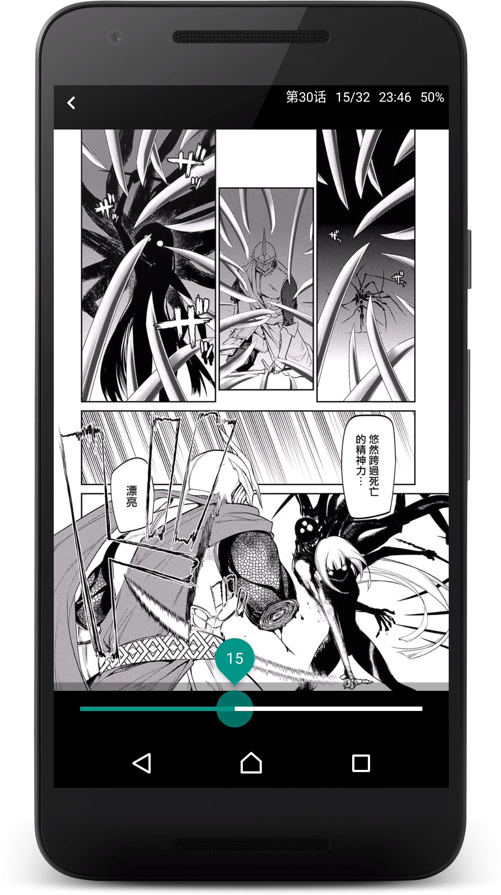

# 应用简介
Android 平台在线漫画阅读器  
Online manga reader based on Android

# 功能简介
- 翻页阅读（Page Reader）
- 卷纸阅读（Scroll Reader）
- 检查漫画更新（Check Manga For Update）
- 下载漫画（Download Manga）
- 本地漫画（Local Reader）
- 本地备份恢复（Local Backup）

# 支持网站
- [看漫画](http://m.ikanman.com)
- [动漫之家](http://m.dmzj.com)
- [手机汗汗](http://hhaazz.com)
- [CC图库](http://m.tuku.cc)
- [有妖气](http://www.u17.com)
- [动漫屋](http://www.dm5.com)
- [Webtoon](http://m.webtoons.com)
- [汗汗漫画](http://hhssee.com)
- [57漫画](http://m.57mh.com)
- [吹妖漫画](http://m.chuiyao.com/)

# 感谢以下的开源项目及作者
- [Android Open Source Project](http://source.android.com/)
- [ButterKnife](https://github.com/JakeWharton/butterknife)
- [GreenDAO](https://github.com/greenrobot/greenDAO)
- [OkHttp](https://github.com/square/okhttp)
- [Fresco](https://github.com/facebook/fresco)
- [Jsoup](https://github.com/jhy/jsoup)
- [DiscreteSeekBar](https://github.com/AnderWeb/discreteSeekBar)
- [RxJava](https://github.com/ReactiveX/RxJava)
- [RxAndroid](https://github.com/ReactiveX/RxAndroid)
- [RecyclerViewPager](https://github.com/lsjwzh/RecyclerViewPager)
- [PhotoDraweeView](https://github.com/ongakuer/PhotoDraweeView)
- [Rhino](https://github.com/mozilla/rhino)
- [BlazingChain](https://github.com/tommyettinger/BlazingChain)

# ToDo
- ~~综合搜索~~
- ~~漫画标签分类~~
- ~~多任务下载~~
- ~~更改下载路径~~
- ~~扫描已下载漫画~~
- ~~阅读状态自定义点击事件~~

# 应用截图

# 增加图源
- 继承 MangaParser 类，参照 Parser 接口的注释
- 可选地继承 MangaCategory 类，参照 Category 接口的注释
- 在 SourceManger 的 getParser() 方法中加入相应分支
- 在 UpdateHelper 的 initSource() 方法中初始化图源